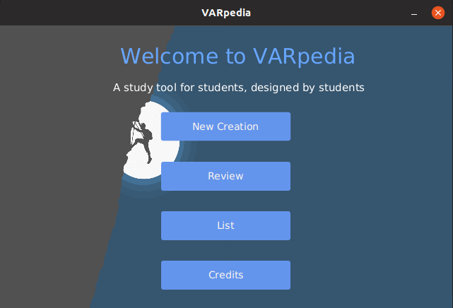
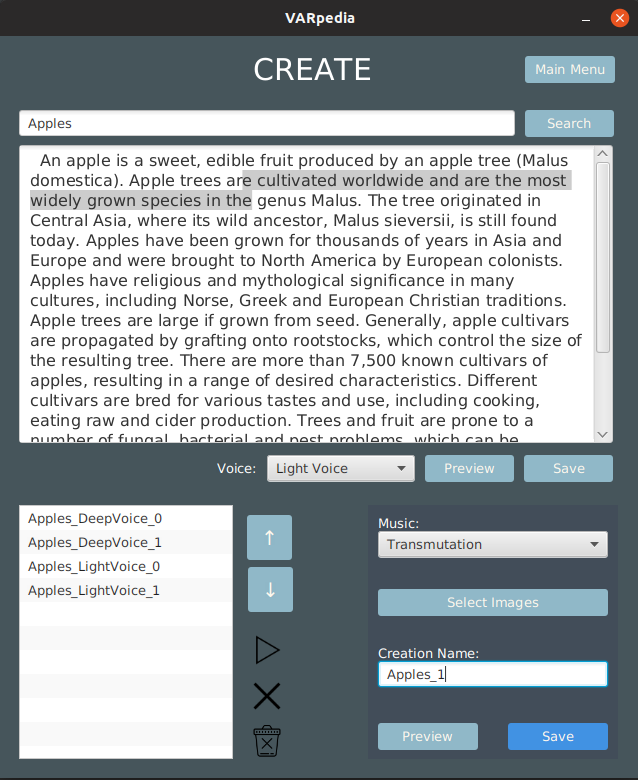

# VARpedia

### SOFTENG206 Assignment

VARpedia (Visual-Aural-Reading) is a tool designed to help young adults learn a secondary language. User can create a 'creation'
video which contains audio snippets of a search term, background images, music, and the search term in the center. The user can then review these creations by playing them back. 

### To run

To be run on Linux (Ubuntu)

User must have Java 13
1. User must install the following command line tools:
*wikit
*ffmpeg
*ffplay
*soxi
*festival
*espeak
2. Clone repository and set up a project.
3. Import the user lib included in the repo.
4. Run the code.

### Screenshots

